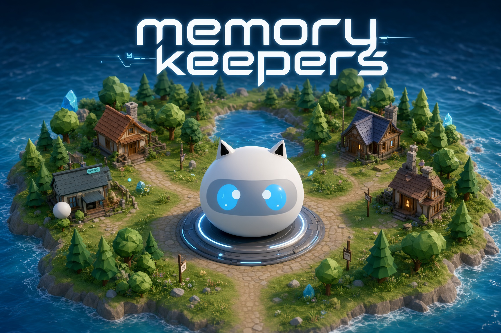

# memory-keepers



A 3D game where keepers (small blob librarians) manage your memories. Each keeper owns a topic (dreams, meetings, music, anything you create), lives in a cottage on a floating island, and keeps a library of books. Tell her something and she writes a book; ask her and she reads her shelves back to you, always grounded in real books. Hold T in any dialog to talk instead of typing, and she answers in her own voice. At night the island dreams: everything that connects across shelves becomes a knowledge graph, and dark keepers are born from what keeps returning.

Built for the All Things Agentic Hackathon (The Collaborative Partner track).

Interactive architecture map: [hec-ovi.github.io/memory-keepers](https://hec-ovi.github.io/memory-keepers/)

Google Cloud architecture (official product icons, print to PDF): [docs/diagrams/google-stack.html](docs/diagrams/google-stack.html)

## Why

Most AI still lives in chatbots: a text box that waits. The question behind this project is how interacting with an AI can feel natural, carry real meaning, and cover the whole spectrum of what you do, instead of solving one narrow problem. We are, in the end, a collection of memories and the events that happened to us, so the app points at life and memory itself.

Each layer of your life gets its own keeper: the music you hear, the movies you watch, the dreams that stay with you, your diet, your workouts, your meetings. Keepers capture who you are in those moments and hand back the details you lose ("that movie three weeks ago, the guy on an airplane?", "what was the urgent thing John asked me for?"). At night the island consolidates the day the way humans do, by dreaming: a knowledge graph connects the layers holistically and surfaces what keeps returning, including what you avoid.

Privacy first: the same code runs against Gemini on Vertex AI or entirely on your own hardware with Gemma open weights, so your memories, conversations, and the graph itself never have to leave your machine.

## Stack

Google products, official names:

- Gemini 3.5 Flash on Vertex AI (global endpoint): keeper replies, synthesis, dream prose
- Agent Development Kit (Python) and Google GenAI SDK: monument root, one AgentTool per keeper (call-and-return), ridge keepers, dream agents
- Cloud Run: one service, engine plus the three.js island
- Firestore: the only store (worlds, keepers, books, sessions, dream runs)
- Pub/Sub and Cloud Scheduler: nightly dream sweep and tired-keeper events
- Cloud Text-to-Speech and Cloud Speech-to-Text: keeper voice and hold T
- Gemma open weights: local tier, same code, MODEL_TIER=local
- Cloud Build, Artifact Registry, Cloud Logging, Cloud Billing: deploy, image, logs, spend cap

Keeper lookup tools (not Google): YouTube and podcast transcripts, song facts (MusicBrainz) and lyrics (LRCLIB), book facts (Gutendex), movie facts and plots (OMDb, Wikidata, Wikipedia). `resolve_date` turns "tomorrow" or "in two weeks" into the calendar date before anything is written.

three.js frontend (no build step), FastAPI engine, Docker.

## Hackathon requirements

All Things Agentic, track The Collaborative Partner. How the stack hits the published rules:

- **Gemini 3.5 or newer:** Gemini 3.5 Flash through Vertex AI, not a stub.
- **Google Agent Framework:** ADK plus GenAI SDK. One required, both present. Keepers are AgentTool so the root can fan out and come back.
- **Google Cloud infrastructure:** Cloud Run, Firestore, and Pub/Sub. One required. Scheduler, speech, and Build sit on top of that.
- **Collaborative Partner:** keepers remember per life layer, ask from real books, ridge keepers guide. Nightly dreaming is the unattended improvement.
- **Innovation (40%):** not a chat box. Books, grounded ask, knowledge graph, dark keepers from what returns.
- **Architecture (30%):** contract boxes, store vs session split, Pub/Sub dreaming because Cloud Run throttles CPU after the response, meters and an island key.
- **Demo (30%):** Cloud Run URL, README spin-up (compose and from-zero deploy), architecture diagram above, contract tests on the real app.
- **Bonus models (0.6 cap):** Gemma (named in the rules), Cloud Text-to-Speech, Cloud Speech-to-Text. Gemini is the required model, not a bonus.
- **Bonus publications (0.4):** blog and #AllThingsAgenticHackathon post still to publish.
- **Video (still to record):** max 4 minutes, live island, say Gemini 3.5 and ADK, show Cloud Console or the `.run` URL.

## Content and sources

Keepers read sources at capture time and store only what they write: a book holds facts, short quotes, and the user's relationship with the work, never a copy of it. Fetched text (a transcript, lyrics, a plot) lives only in the model's context while the book is written. Sources are chosen by license: MusicBrainz facts (CC0), Wikipedia plots (CC BY-SA, cited in the book), Project Gutenberg full texts only when a book is public domain, and podcast transcripts only when the publisher ships one in the feed.

## Run locally (zero cloud cost)

```
docker compose up
```

The game is at http://localhost:8000, running against the official Firestore emulator (browse it at http://localhost:4000). Your worlds live in `./.data/firestore` on the host, snapshotted every minute, so they survive restarts, rebuilds, and docker cleanups; delete that folder to start clean. One switch picks the brain, nothing else changes:

| MODEL_TIER | brain | needs |
|---|---|---|
| `fake` (default) | deterministic in-process model | nothing |
| `local` | Gemma on a llama.cpp server on the host | a machine that fits it |

Nothing installs on the machine; everything lives in the containers.

The local tier needs a llama.cpp server on the host (any OpenAI-compatible server works). With a Gemma GGUF:

```
llama-server --model <path to gemma .gguf> --alias gemma-4-26b-a4b-qat-q4 \
  --host 0.0.0.0 --port 8080 --jinja -ngl 99
MODEL_TIER=local docker compose up -d
```

Defaults line up: the island looks for `http://host.docker.internal:8080/v1` and asks for the model id `gemma-4-26b-a4b-qat-q4`; override with `LOCAL_MODEL_URL` and `LOCAL_MODEL_ID` if your server differs. The engine's health check probes the model server, and the game refuses to open while it is down, so a dead brain shows up at the door instead of as strange answers.

To fill a world with sample memories and test the whole loop (tells, grounded asks, a dream with its knowledge graph):

```
python3 scripts/demo_world.py http://localhost:8000 demo --verify
```

## Sample island

`samples/hector-island.json` is a whole island exported from this game: the author's own memories, told to five keepers through the real tell flow on the local tier (career, studies, repos, literature with two books told chapter by chapter, and Cronenberg films), loose remarks on every shelf, the ridge dreamed from what recurs across them, and the conversations behind every book. Load it with the HUD's Import island button (it lands on a fresh island id of its own, never on yours), then ask a keeper something, open a book, send her a remark, talk to the ridge, or run Dreaming.

To build an island from your own memories, write them as the seeder's JSON (keepers with `memories`, optional `remarks` sent through the router, and an `ask` to verify) and run:

```
python3 scripts/demo_world.py http://localhost:8000 mine --verify --memories my_memories.json
```

Export island then saves it as one file.

## Tests

```
docker compose run --rm test            # python boxes (79 tests)
docker compose run --rm test-frontend   # frontend (693 tests)
```

Real FastAPI app, real ADK runner and tools, fake Firestore client (same suites pass against the emulator when `FIRESTORE_EMULATOR_HOST` is set); frontend on vitest + jsdom + Testing Library + MSW.

## Deploy to Google Cloud (from zero)

Four steps from a blank Google account to your own island; `scripts/deploy.sh` does the heavy lifting.

1. Install the [gcloud CLI](https://cloud.google.com/sdk/docs/install) and sign in:

   ```
   gcloud auth login
   ```

2. Create a project and link your billing account (project ids are global, pick any unique suffix):

   ```
   gcloud projects create my-island-4821
   gcloud billing accounts list
   gcloud billing projects link my-island-4821 --billing-account=<ACCOUNT_ID from the list>
   ```

3. Clone and deploy:

   ```
   git clone https://github.com/hec-ovi/memory-keepers && cd memory-keepers
   export INTERNAL_TOKEN=$(openssl rand -hex 16)
   PROJECT=my-island-4821 scripts/deploy.sh
   ```

4. Open the URL the script prints. Done: the script enabled the APIs and created the Cloud Run service (engine + frontend), Firestore, the `dream-runs` Pub/Sub topic with its push subscription, and the nightly Cloud Scheduler dream sweep.

No permissions to grant by hand: you created the project, so you own it, and Cloud Run runs as the project's default service account, which on a personal project already reaches Firestore, Vertex AI, and the speech APIs. Inside a company organization with hardened defaults, give that service account `roles/datastore.user` and `roles/aiplatform.user`.

Optional env before step 3: `ACCESS_CODE=<island key>` gates the API behind `X-Access-Code` (visitors enter it once, or open a `?key=` link; anonymous traffic never reaches a model). `OMDB_KEY=<free key>` adds IMDb ratings to movie lookups. `MIN_INSTANCES=1 CPU_ALWAYS=1` keeps one instance warm for demo days. `scripts/deploy_billing_cap.sh` adds a hard spend stop: a budget event detaches billing at the line.

### Or let Gemini set it up

The same four steps, driven by [Gemini CLI](https://github.com/google-gemini/gemini-cli):

```
npm install -g @google/gemini-cli
gemini
> Clone https://github.com/hec-ovi/memory-keepers and follow the "Deploy to Google
> Cloud (from zero)" steps in its README: create a project, link my billing account,
> deploy with a random INTERNAL_TOKEN, and tell me the URL when done.
```

## Layout

Box map and dependency edges: `docs/INDEX.md`. Each box is one folder with a CONTRACT.md; the contract alone is enough to use the box.

| box | what |
|---|---|
| `frontend/` | three.js SPA, no build step |
| `engine/` | FastAPI surface, world scoping, meters, jobs |
| `agents/` | ADK: monument root agent, keeper agents (tell, ask, talk, notes), ridge keepers, dream agents |
| `library/` | Firestore store: worlds, keepers, books, sessions, dream runs |
| `models/` | model gateway: cloud / local / fake tiers |
| `dreaming/` | consolidation: linking pass and dark side writer |
| `voice/` | Cloud TTS / STT router |
| `lookups/` | keeper tools: transcripts, lyrics, movie facts |
| `samples/` | a whole island to import: the author's memories |
